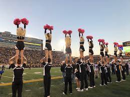

## What Cheer Means To Me

Cheer has provided multiple different opportunities for me though the years. 
I found some of my best friends thought this sport such as Maddie and Ethan.
Cheer made a major impact on my schooling throughout highschool, as it pushed me to work harder in all my classes.
I cheered my sophmore though senior year in high school and even made it on the Mizzou cheer team. I countinue to push myself in all things cheer has to offer, weather that be stunting, tumbling or cheers. 
I have learned so many lessons through cheer that I will keep with me for the rest of my life. 
I will never forget the countless memories made at practices, cheering on the sidelines, or at competitons.
I will forever be thankful for cheer and everything it has brought to my life.

Here is where it all started at on my high school cheerleading team, [Timberland Cheer](https://sites.google.com/wsdr4.org/timberlandcheer).