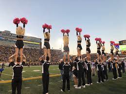

### What cheer means to me

Cheer has provided multiple different things for me. 
I found some of my best friends thought this sport.
Cheer was a major impact in my schooling throughout highschool as it pushed me to work harder in my classes.
I cheered my sophmore-senior year in high school and even made it on the Mizzou cheer team. 
I have learned so many lessons through cheer that I will keep with me for the rest of my life. 
I will forever be thankful for cheer and everything it has brought to my life.

 []

 Here is where it all started at [Timberland Cheer](https://sites.google.com/wsdr4.org/timberlandcheer) 